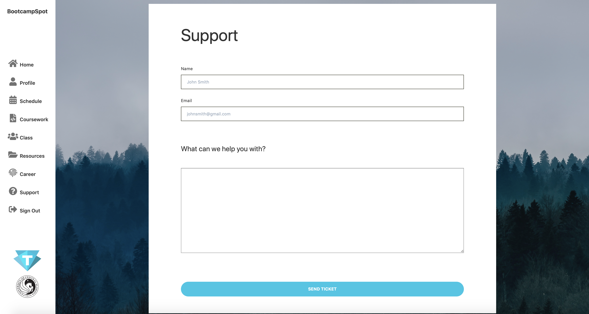

# Bootcampspot
### :octocat: A redesigned version of the Bootcampspot portal used by Trilogy Education, using following technologies: MongoDB, Express.js, React.js, Node.js, Tailwind CSS.

Bootcampspot is a portal where coding bootcamp students can see their schedule, grades, attendance and submit required courseworks. With this redesigned version of the bootcampspot, I kept the features that were already done by the current bootcampspot, but also aimed to change the site into a semi-social network, where students can design their own profiles, see each others profiles and make announcements to their own classmates. 

## How It Works

### Sign Up

    

## Usage

1. After signing in, users are redirected to a **personalized announcements page**.

   :curly_loop: User can add an announcement, like and/or comment to other peoples announcements.

    

2. Users can **edit their own profiles**, which will be displayed at Class page.

    

3. Users can **see their schedules** and each session has a short introductory material. Schedule page can only be edited by instructors.

    

4. Users can see their required **coursework** and submit their courseworks.

    
    

5. Users can see their classmates' **profiles**

    
    

6. Users can see **recommended resources** of each subject. Resources page can only be edited by instructors.

    

7. If there are any problems, users can fill **support** tickets.

    

